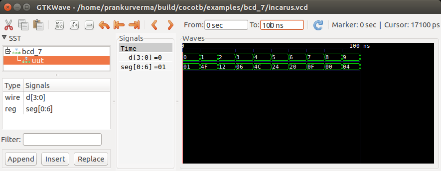

# Verification Skill Task

Please follow the instructions to reproduce my setup to build and run the python testBench for the given verilog example using CoCoTB.

## Introduction

This is my submission for Verification Task **B1. CoCoTb based Verification**.

## Instructions

1. Install dependencies:

   ```
   sudo apt-get install virtualenv build-essential
   sudo apt-get install python3-dev
   sudo apt install gtkwave
   ```

2. Installing CoCoTB-Verilator Build:

   ```
   git clone https://github.com/antmicro/cocotb-verilator-build.git build
   cd build
   git submodule update --init
   make env/bin/verilator
   make env/bin/cocotb-config
   ```

3. Add the BCD_7 folder to the following location:
   build/cocotb/examples

4. Running Python TestBench:
   ```
   make cocotb/bcd_7/run
   ```
   The testBench will be executed with CoCoTB and verilator with zero errors. To see the waveform run the following commands:
   ```
   iverilog bcd_7.v bcd_7_tb.v
   vvp a.out
   gtkwave test.vcd
   ```
   
   The test output is shown in the picture below:
   


## References

I would like to mention the following references which helped me in completion of this task:

  * **[CoCoTb-Documentation](https://readthedocs.org/projects/cocotb/downloads/pdf/latest/)**.
  * [CoCoTB-Verilator build](https://github.com/antmicro/cocotb-verilator-build.)
  * [verilog-examples](https://gitlab.com/jjchico/verilog-examples/) - Various *verilog* examples.
  * [python-testBench guide](https://www.youtube.com/watch?v=DtzD2UM-Dzg) - How to configure Makefile and write python testbench.
  * [Icarus Verilog](http://iverilog.icarus.com/).

## Authors

  * **Prankur Verma**
